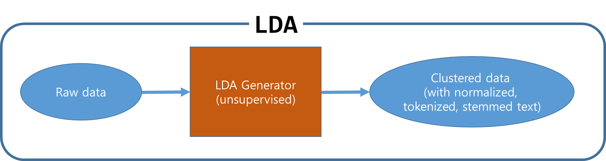
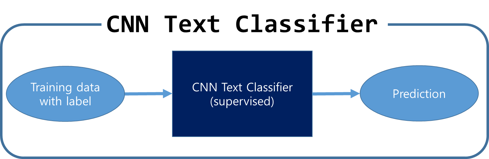
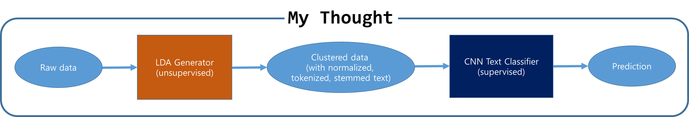

# LDA_CNN_Text_Classifier
prepare the input data for CNN text classification  using LDA

## Introduction
The notebook "Stock_prediction_new_crawler.py" introduces grouping and preparing input data for CNN text using LDA.

## Contents
1. scrap the news for google finance
2. Prepare text for LDA
3. build LDA and grouping text
4. mapping text data and LDA category with stock price data
5. run CNN text classification.
6. random searching for hyperparmeter

## LDA

## CNN_Text_Classification

## LDA

## Conclusion
# conclusion.
    # the result of this model is just good but not reached my expectation.
    # the google finance news has just little news.
    # i scrap the naver news for sk Hynics 
    # there are more than 3000 news from 2012 years to now.
    # using korean stop words i build the same model.
    # at that moment, i change the code little. i seperate training data and test data totally.
    # In above model, train data and test data is mixed like bootstrap. this can cause that the test accuracy is so good. because the ML can remember the training data and test data.
    # for testing the prediction, not memory, i seperate training data and test data. 
    # the traning data would be used for traning only and test data too.
    # But result is still bed. Accually really reallly bed.(the mean of performance(accuracy) is just about 25%)
    # when i read the CNN text classifier, the accuracy can be about 0.8.
    # i cannot find out what is really worng.
    # please help me siraj, give me some advices.
    # i really really really want to make the prediction for stock price and ML for stock.

## Dependencies
* selenium
* pandas
* datetime
* newspaper
* nltk
* gensim
* numpy
* random
* matplotlib

All dependencies can be installed using [pip](https://pip.pypa.io/en/stable/)
